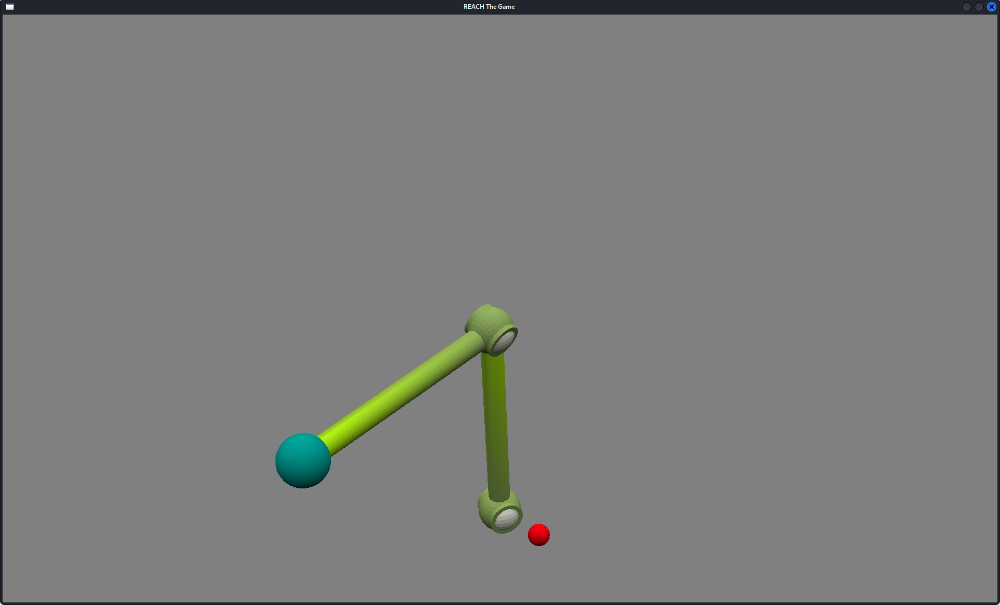

# Reach

Author: Sirui Huang

Design: Robotics is hard. Try to reach the goal with the tip of your heirarchical arm!

Screen Shot:

How To Play:
N to rotate the body of the arm clockwise,
M to rotate the body of the arm counterclockwise;
J to rotate the root rod clockwise,
K to rotate the root rod counterclockwise;
I to rotate the branch rod clockwsie,
O to rotate the branch rod counterclockwise.
A,S,D,W to move the camera.

This game was built with [NEST](NEST.md).
